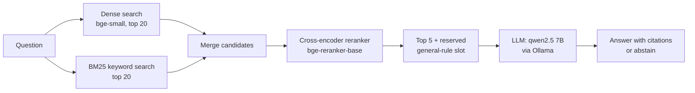

# VU Study Assistant: RAG over university regulations

A question-answering assistant for students of the **MSc Artificial Intelligence at Vrije Universiteit Amsterdam**. It answers questions about exam rules, resits, admission and courses using only the official study guides and Teaching and Examination Regulations, cites its sources, and says *"I couldn't find this"* instead of guessing.

Runs **fully locally** on a laptop (no API keys, no data leaves the machine).

> **Headline result:** on a 48-question evaluation set, retrieval Recall@5 went from **0.81 → 0.95** and answers containing the correct key facts from **0.81 → 0.91**, with **zero hallucinated answers on unanswerable questions**.


---

## Example

```
$ python src/generate.py "Can I resit an exam I already passed to get a higher grade?"

Yes, a resit is allowed for both passed and failed units, but the most recent
mark applies, even if it is lower than your original grade [1].

Sources:
  [1] Artificial Intelligence TER 2026-2027 - Article 3.5 Examination opportunities
  ...
```

<!-- TODO: replace with a real output from your final system -->

---

## How it works



| Stage | What it does | Why |
|---|---|---|
| **Ingestion** | Parses PDFs into one chunk per course section / regulation article, with metadata (course code, article, programme, year) | Chunk boundaries follow the documents' own structure, so a rule is never cut in half |
| **Dense search** | Embedding similarity (`BAAI/bge-small-en-v1.5`, ChromaDB) | Understands meaning: "resit" ≈ "second examination opportunity" |
| **BM25** | Keyword search, implemented from scratch | Precise on exact course names and codes like `XM_0189` |
| **Reranker** | Cross-encoder reads question and chunk *together* (`BAAI/bge-reranker-base`) | Far more accurate ordering than comparing embeddings |
| **Reserved slot** | If no general regulation is in the top 5, the best-ranked one replaces #5 | General rules apply to every student; the reranker tends to prefer course pages |
| **Generation** | Local LLM answers *only* from numbered, scope-labelled sources | Citations make every claim verifiable; abstains when sources don't cover the question |

---

## Evaluation

I built the evaluation **before** optimising anything, so every change is measured rather than guessed.

**Eval set:** 48 hand-checked questions written in a student's voice
(17 course lookups, 17 regulation questions, 7 multi-hop, 7 unanswerable).
Each answerable question is labelled with the *location* of its answer (e.g. `Article 3.5` or `course XM_0083, Method of Assessment`) rather than a chunk ID, so labels stay valid when chunking changes.

**Retrieval metrics:** Recall@1, Recall@5 (is the answer in what the LLM sees?), MRR.
**Generation metrics:**
- *Abstention*: says "I couldn't find this" on unanswerable questions, and *only* on those
- *Key-fact coverage*: does the answer contain the facts that matter (e.g. "the most recent mark applies")?
- *Citation accuracy*: does it cite the source that actually holds the answer?

### Results (48 questions)

| System | R@1 | R@5 | MRR | Key facts | All facts | Gold source retrieved | Wrong abstain |
|---|---|---|---|---|---|---|---|
| Dense retrieval | 0.61 | 0.81 | 0.71 | 0.81 | 0.80 | 33 / 41 | 0.05 |
| + BM25 candidates + reranker | 0.73 | 0.90 | 0.79 | 0.88 | 0.85 | 37 / 41 | 0.00 |
| **+ reserved general-rule slot** | **0.73** | **0.95** | **0.80** | **0.91** | **0.88** | **39 / 41** | **0.00** |

All runs: abstained on **7 / 7** unanswerable questions; gold-source citation accuracy 0.97–1.00. Average answer time ≈ 4–5 s on a MacBook Air (16 GB RAM).

**Recall@5 by question type**

| System | Course lookups | Regulations | Multi-hop |
|---|---|---|---|
| Dense | 0.71 | 0.94 | 0.71 |
| + Reranker | **1.00** | 0.88 ⬇ | 0.71 |
| + Reserved slot | **1.00** | **0.94** | **0.86** |

The breakdown shows something the averages hide: the reranker fixed every course lookup but *pushed general regulations down*. The reserved slot was designed specifically to counter that, and recovered regulation recall without costing anything on course lookups.

### Earlier phase (15-question set, not comparable with the table above)

| Change | R@1 | R@5 | MRR |
|---|---|---|---|
| Baseline chunking | 0.54 | 0.77 | 0.63 |
| Chunking v2 (facts as sentences, split list-style articles, separate footnotes) | 0.69 | 0.92 | 0.79 |

Better data preparation alone gave the biggest single jump in the project.

---

## What didn't work (and why)

**Hybrid search with Reciprocal Rank Fusion.** Fusing dense and BM25 rankings with RRF *lowered* key-fact coverage from 1.00 to 0.62 on the 15-question set. RRF rewards chunks that are mediocre in both rankings over chunks that are excellent in one; BM25 fails completely on paraphrased questions ("graded" vs "grade") but still got an equal vote. Using BM25 only to *nominate* candidates for the reranker fixed this.

**A score threshold for "no answer".** Reranker scores look well separated on average (0.70 answerable vs 0.10 unanswerable), but the distributions overlap: the lowest answerable question scored 0.002, the highest unanswerable 0.55 (a deliberately tricky near-miss question). No threshold separates them, so abstention stays with the LLM, which reads the sources.

**Prompt tuning on a 3B model.** With `llama3.2:3b`, three prompt versions gave three different answers to the same question. When small prompt changes flip answers, the model is the bottleneck. Switching to `qwen2.5:7b` fixed it.

---

## Error analysis: what I learned from the failures

- **Retrieval failures become confident wrong answers.** When the right source wasn't retrieved, the LLM rarely abstained; it reasoned from the wrong pages and sounded just as sure. Retrieval quality is the safety ceiling of the system.
- **"Smoothie" chunks.** An article listing six unrelated curriculum changes produced an embedding that matched none of them well. Splitting list-style articles into one chunk per item fixed it.
- **Forms vs sentences.** `Credits: 30` retrieved poorly; "Master Project AI is worth 30 EC (30 ECTS credits)" retrieved well.
- **Sources need context, not just text.** Labelling each source as *general rule* or *course-specific* stopped the model applying one course's rules to everyone.
- **Evaluations have bugs too.** Keyword checks produced both false passes (a wrong answer containing the word "no") and false failures (correct paraphrases). Auditing the grader was as important as improving the system.
- **Log every setting.** Two silent config mix-ups (wrong LLM, wrong retrieval mode) produced misleading results until every run printed and saved its full configuration.

**Remaining failures (41 answerable):** 2 retrieval misses (the reserved slot picks the wrong regulation article) and 1 numeric reasoning error (the model treats 12 EC as meeting an 18 EC requirement).

---

## Project structure

```
src/
├── config.py               # all settings: models, paths, retrieval mode
├── ingest.py               # PDFs -> structured, metadata-rich chunks
├── index.py                # embed chunks into ChromaDB
├── retrieve.py             # dense / BM25 / hybrid / rerank retrieval
├── generate.py             # prompt construction + local LLM (Ollama)
├── evaluate.py             # retrieval metrics (Recall@k, MRR)
└── evaluate_generation.py  # abstention, key facts, citations
data/
├── raw/manifest.csv        # which documents to download (PDFs not included)
└── eval/questions.jsonl    # 48-question evaluation set
experiments/                # every evaluation run, with its full configuration
```

## Quickstart

1. Download the documents listed in `data/raw/manifest.csv` from the VU website into `data/raw/`
   (the PDFs are VU's and are not redistributed here).
2. Install [Ollama](https://ollama.com) and pull the model: `ollama pull qwen2.5:7b`
3. Set up and run:
### Run the web app

```bash
streamlit run src/app.py
```

On macOS you can also double-click `start.command`.

```bash
python -m venv .venv && source .venv/bin/activate
pip install -r requirements.txt
python src/ingest.py
python src/index.py
python src/generate.py "Can I resit an exam I already passed?"
```

Evaluate: `python src/evaluate.py` and `python src/evaluate_generation.py`.

## Limitations and next steps

- **Single programme and year.** Multi-year support (metadata filtering by academic year) is the obvious next step.
- **Keyword-based grading** misses meaning; an LLM-as-judge would grade paraphrases more reliably.
- **Smarter regulation selection** for the reserved slot (the source of both remaining retrieval misses).
- **Not official advice.** Answers should always be checked against the cited source or an academic adviser.

## Tech stack

Python · pdfplumber · sentence-transformers · ChromaDB · BM25 (from scratch) · cross-encoder reranking · Ollama (qwen2.5 7B)

---

*Built by Munishwar Pradhan, MSc AI student at VU Amsterdam.* <!-- TODO: add LinkedIn / contact -->
Background photo: "Amsterdam VU" by Rokus Cornelis, CC BY 3.0, via Wikimedia Commons (modified: faded and blurred).
